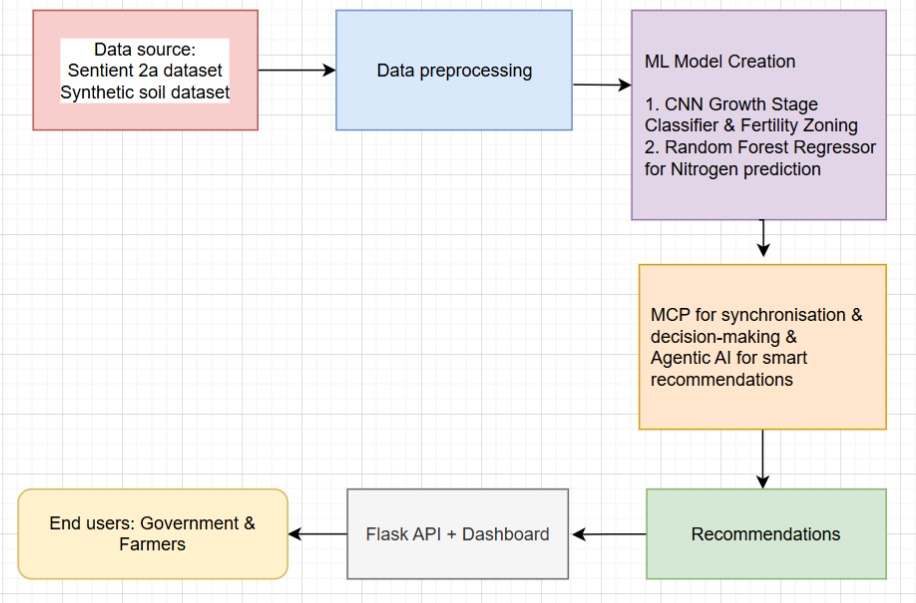

# AI-Powered Potato Crop Growth Stage & Nutrient Health Management

## Project Description
This project develops an AI-powered solution that uses satellite imagery and machine learning to monitor potato crop growth stages and assess nutrient health. By integrating geospatial analytics, CNN-based classification, and Random Forest regression, the system generates stage-specific irrigation and fertilizer recommendations.

The platform is designed to be scalable, cost-effective, and farmer-centric, with the ultimate goal of maximizing yield, reducing costs, and promoting sustainable soil health.

## Problem Statement

Potato farmers in Tamil Nadu face the following persistent challenges that reduce productivity and profitability:

Unreliable crop growth stage monitoring due to reliance on manual scouting.

Cloud cover and irregular field monitoring leading to gaps in health assessment.

Inefficient nutrient management causing over-fertilization or under-fertilization.

Increased vulnerability to pests and diseases without early-warning systems.

Limited access to affordable precision agriculture solutions tailored to regional needs.

These factors directly affect yield, income stability, and long-term soil quality.

## Why It Matters

Even a 10% improvement in potato yield in Tamil Nadu translates to an extrapolated additional 20,000 tonnes of production, boosting farmer incomes by approximately ₹80–100 crore at today’s farm-gate prices. Optimizing growth stage interventions and nutrient management is not only a matter of food security but a path to economic transformation for farming communities.

## Methodology

Data Acquisition

Sentinel-2 satellite imagery (10m/20m resolution).

Vegetation indices (NDVI, NDRE).

Soil fertility datasets.

Historical yield and weather data for refinement.

Preprocessing

Cloud masking to remove unusable pixels.

Image mosaicing for seamless field views.

Normalization and extraction of vegetation indices.

## AI/ML Modeling

Convolutional Neural Networks (CNNs): Crop growth stage classification into at least three stages.

Random Forest Regression: Prediction of nitrogen levels and mapping of nutrient health.

Fertility-Based Zoning

Field segmentation into high, medium, and low-fertility zones.

Integration with crop stage data for precise recommendations.

Decision Intelligence Layer (MCP + Agentic AI)

Model Control Program (MCP) connects classification and nutrient modules.

Agentic AI generates actionable recommendations: stage-specific irrigation and fertilizer planning.

## Tech Stack

Geospatial Tools: Google Earth Engine, Rasterio, GDAL, QGIS.

AI/ML Models: CNN for growth stage classification, Random Forest/Gradient Boosting for nutrient prediction.

Pipeline Orchestration: MCP for model integration and workflow scheduling.

Agentic AI Layer: Generates zone-wise, stage-specific advisories.

Farmer Application: Web and mobile dashboards with visualization and notifications.

## Key Features

Automated weekly satellite image processing pipeline.

Growth stage classification across potato lifecycle.

Nutrient health monitoring and fertility-based zoning.

Cost-optimized irrigation and fertilizer recommendations.

Farmer-facing dashboards for visualization and alerts.

## Impact

Visionary impact: Supports food security and productivity at scale.

Tech innovation: Converts raw geospatial data into actionable decisions.

Farmer value: Provides simple, intuitive insights for better decision-making.

Sustainability: Protects soil health and promotes resource-efficient farming.

## Future Scope

Expand to other crops beyond potato.

Integration with IoT-based soil sensors for hybrid data fusion.

Advanced pest/disease detection using hyperspectral imaging.

State-wise farmer community platforms for knowledge sharing.

## PipeLine Workflow

---

## App Screenshots

### Home & Dashboard

<!-- Repeat for all remaining screenshots -->

---

### Website Screenshots

<!-- Add more if needed -->

---

## ML Model Screenshots

<!-- Add more ML screenshots -->

---

